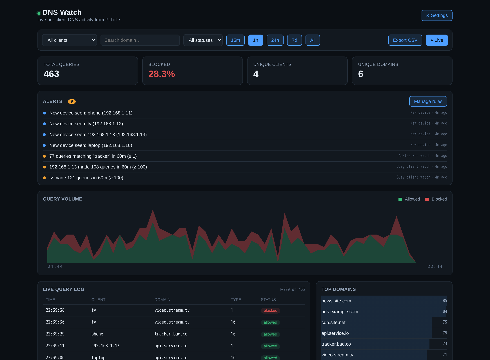
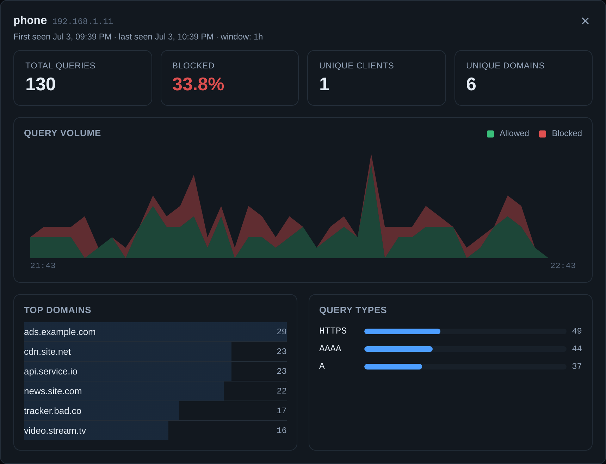
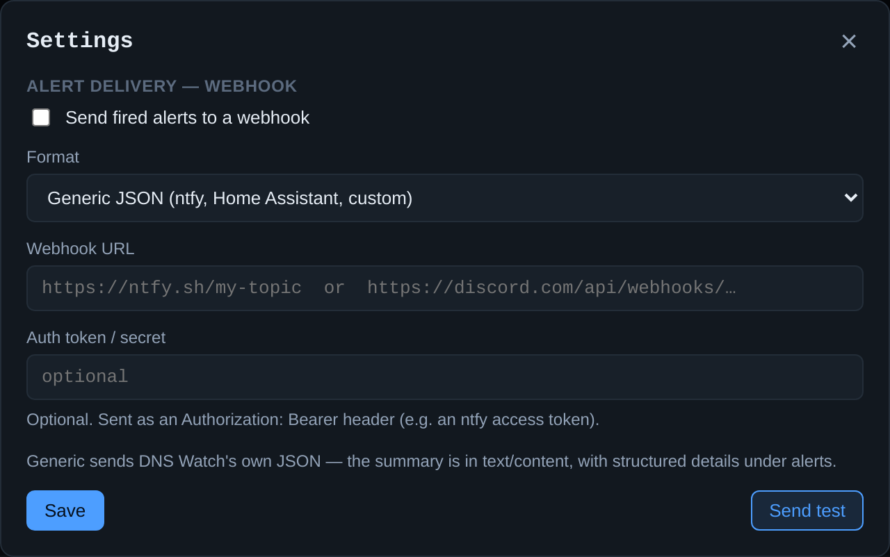

# DNS Watch — a live per-client DNS dashboard for Pi-hole

[](https://github.com/Notsubtle/DNS-Watch/actions/workflows/ci.yml)

A small, self-hosted dashboard that sits **next to** your existing Pi-hole container,
reads its query database directly, and gives you a filterable, live view of which
device is visiting which domain.



Visual style borrows the "ink" dark palette from the Jooce dashboard project (same
CSS variable approach), but this is a fresh, purpose-built app — different data
model entirely (DNS queries/clients, not coding sessions).

```
dns-dashboard/
  docker-compose.yml     <- run this alongside your existing pihole docker-compose
  server/                <- FastAPI backend, reads pihole-FTL.db read-only
  web/                   <- Vite + React + TypeScript frontend
```

## Who it's for & what it solves

Pi-hole tells you *how much* is being blocked across your whole network. DNS Watch
answers the two questions it doesn't: **"what is *this device* doing?"** and **"tell
me when something changes — without me watching."**

It's aimed at anyone running Pi-hole on a home or homelab network who wants
per-device visibility and wants to be *notified* about changes rather than have to
go looking:

- **Privacy-minded** — see which smart TV, speaker, or doorbell phones home the
  most, and to which trackers.
- **Parents / households** — watch what a specific device is doing, or get alerted
  when it hits domains you care about. Group devices under a **tag** (e.g. "kids",
  "guest") to filter the dashboard or scope a rule to the whole group at once,
  instead of duplicating it per device.
- **Security hobbyists** — get flagged when a **new/unknown device** joins (including
  by **vendor**: a device whose manufacturer can't be identified at all, or the first
  device on your network from a brand you've never seen before), when a **domain no
  client has ever queried before** shows up network-wide, when a device queries a
  **known DoH/DoT provider** (a signal it may be setting up a path around Pi-hole),
  when a device's query volume **spikes** (possible malware or DNS exfiltration), or
  when a normally-active device **goes quiet** (offline or tampered with). Spikes and
  silences are also surfaced **automatically** in a **Network Anomalies** panel,
  measured against each device's *own* 7-day baseline — no rule setup required.
- **Tinkerers** — a filterable, per-client live log for debugging a chatty device or
  a false-positive block.
- **Investigators** — when something looks off, dedicated tools to dig in: a live
  **"tail -f" stream** to watch queries scroll by in real time (with your own colour
  highlight rules), a **blocklist simulator** to measure what a Pi-hole-style regex
  *would* have blocked over the last 7 days before you commit it, a per-client
  **activity heatmap** that exposes background chatter during the hours a device is
  supposed to be idle, and a **domain fan-out** view that surfaces several devices
  hitting the same domain within the same short window — synchronized beaconing a
  per-client view can't show on its own.

The feature that makes it more than a prettier Pi-hole dashboard is **headless
alerting**: rules are evaluated server-side on a timer and pushed out via webhook,
so it *tells you* about things instead of only showing them when you happen to look
— including as an optional daily/weekly **digest** for anyone who'd rather get one
summary than a stream of individual alerts.

**Honest scope:** DNS Watch *observes* — it doesn't block (Pi-hole does that) and it
isn't a full intrusion-detection system. It only sees DNS *names* that actually pass
through Pi-hole, so a device using DoH (DNS-over-HTTPS), a hardcoded resolver, or a
VPN bypasses Pi-hole and won't show up here. This is also why DNS Watch doesn't try
to *actively probe* whether a quiet device is still online: its container has no
visibility into your LAN beyond what Pi-hole's own database already recorded (no
host networking, no raw-socket capabilities), so any "is it really offline?" check
of its own would be guesswork dressed up as a fact. Instead, when a device goes
quiet — via an Alert rule or the automatic Anomalies panel — the qualifier attached
tells you exactly what DNS Watch does and doesn't know: if it has ever seen a real
MAC address for that client, the note reads "may be offline, or may have switched to
a different DNS resolver (DoH, VPN, hardcoded upstream)"; if Pi-hole never captured
one (a value Pi-hole itself represents as an `ip-<address>` placeholder — common for
cross-subnet/VLAN traffic, an expired DHCP lease record, or a gap after a Pi-hole
restart), the note says presence simply can't be determined, rather than guessing
either way.

## Why DNS Watch, when Pi-hole already has a dashboard?

Pi-hole's built-in admin UI is genuinely good, and DNS Watch is **not a replacement**
for it — you still use Pi-hole's own dashboard to manage blocklists, DHCP, upstream
resolvers, and everything else. DNS Watch is a **focused, read-only lens** for one
job Pi-hole's dashboard doesn't really cover: *watching what each device on your
network is doing, and telling you when something changes.*

What it adds on top of Pi-hole's dashboard:

- **Per-client first.** Pi-hole's dashboard is aggregate-first (totals, then you dig
  for per-device detail). DNS Watch is built the other way around: client is a
  first-class filter, every top client has an activity **sparkline**, and you can
  slice the whole view to a single device instantly.
- **New-device flagging.** Any device whose first-ever query landed in the last 24h
  gets a **NEW** badge. Pi-hole won't tell you a new gadget just joined your network;
  this does — which is exactly when an unexpected device matters most.
- **Proactive alerting Pi-hole simply doesn't have.** Rules for query-volume spikes
  (per-client or overall), new devices, and domain-keyword watches — with optional
  **webhook delivery** to ntfy, Home Assistant, Slack, or Discord. Pi-hole *shows*
  you data; DNS Watch can *notify* you without you having a tab open.
- **Domain drill-down.** Click any top domain to see exactly which clients queried
  it in the current window — a workflow that's clunky in Pi-hole's query log.
- **Works even with Pi-hole's UI locked down.** It reads the FTL database directly,
  so it keeps working if you've hardened or disabled Pi-hole's admin web UI. It also
  never writes to Pi-hole — the database is opened strictly read-only, so there's
  zero risk to DNS resolution.
- **Yours to extend.** It's a small FastAPI + React app — add rule types, panels, or
  exports to fit how *you* watch your network. CSV export of the current filtered
  view is built in.

In short: keep Pi-hole for **controlling** DNS; add DNS Watch for **observing and
being alerted about** per-client activity.

## Screenshots

Click a client for its full profile — its own volume chart, top domains, query
types, and first/last-seen:



Optional webhook alert delivery (ntfy / Home Assistant / Slack / Discord), with a
"Send test" button:



> Screenshots use synthetic sample data, not a real network.

## How it works

- Pi-hole (FTL) already logs every DNS query to a SQLite database at
  `/etc/pihole/pihole-FTL.db` inside its container/volume.
- This app **never touches Pi-hole's DNS resolution path** — it only opens that
  database file **read-only** and serves it up as a filterable API + UI.
- No changes to your Pi-hole container are required. Zero risk of interfering with
  DNS resolution.

## Setup

### 1. Locate your Pi-hole data volume

From your existing `~/pihole/docker-compose.yml`, you're already mounting:
```yaml
volumes:
  - './etc-pihole:/etc/pihole'
```
That `./etc-pihole` folder (on the Ubuntu host) contains `pihole-FTL.db`. Note its
absolute path, e.g. `/home/steve/pihole/etc-pihole`.

### 2. Configure this project

```bash
cd dns-dashboard
cp .env.example .env
# edit .env: set PIHOLE_ETC_PATH to the absolute path from step 1
```

### 3. Run it

```bash
docker compose up -d --build
```

Dashboard: `http://<ubuntu-host-ip>:8090`

### 4. Local dev (optional, hot reload)

```bash
# backend
cd server
pip install -e . --break-system-packages
# DNSWATCH_DB_PATH is where alert rules/events are stored; point it somewhere
# writable in local dev (it defaults to /data/dnswatch.db, the Docker volume).
PIHOLE_DB_PATH=/path/to/pihole-FTL.db DNSWATCH_DB_PATH=./dnswatch.db \
  uvicorn app.main:app --reload --port 8090

# frontend (separate terminal)
cd web
npm install
npm run dev    # http://localhost:5173, proxies /api to :8090
```

## What you get

The app is organised into tabs: a **Dashboard** (everything below down to
"Optional login"), plus three focused analysis views — **Live Stream**,
**Blocklist Simulator**, and **Client Heatmaps** — described under
"Analysis tabs" further down.

- **Live query table** — every DNS query, auto-refreshing, with client, domain,
  status (allowed/blocked), and timestamp. Scrolls internally within a fixed-height
  panel (newest first) instead of growing the page.
- **Filters** — by client (dropdown of known devices, searchable by vendor — e.g.
  type "Espressif" to narrow the list to just those devices), **by tag**
  (a user-defined group like "kids"/"IoT"/"guest" — see **🏷 Manage Tags** in the
  header), or **by vendor as a dashboard-wide scope** (pick "Espressif Inc." from
  the same filter dropdown to re-scope every panel — summary, top domains,
  timeseries, query log — to every device from that manufacturer at once, not
  just narrow the device list). Tag/vendor/single-device selection is mutually
  exclusive — picking one clears the others. Also filterable by domain
  (substring search), status (allowed / blocked / all), and time range
  (15m / 1h / 24h / 7d / custom).
- **Summary cards** — total queries, blocked %, unique clients, unique domains for
  the current filter/time window.
- **Top domains / top clients** — ranked lists for the current filter window.
  Top clients show a per-client activity **sparkline** and a **NEW** badge for
  devices first seen in the last 24h. Click a top domain to open a **drill-down**
  showing which clients queried it, or click a **client** to open its full
  **detail view** (its own volume chart, top domains, query types, first/last seen).
- **Query-volume chart** — a time-series of allowed vs. blocked queries across the
  selected range, bucketed and hoverable.
- **Query-type breakdown** — A / AAAA / HTTPS / PTR / … distribution.
- **CSV export** — download the current filtered query view.
- **Pagination** — the query log is paged with an exact total ("201–400 of 5,000").
- **Alert rules** — watch for query-volume spikes (per-client, per-**tag**, or
  overall), new devices, an **unrecognized or new vendor** joining (complementary
  to "new devices": this one is keyed on the device's manufacturer rather than
  its raw IP — fires when a device's vendor can't be identified at all, or when
  it's the network's first-ever device from a vendor it does recognize),
  specific domain keywords (optionally scoped to a tag too), a **first-seen
  domain** (the domain-keyed sibling of "new device"/"new vendor" — fires when
  a domain is queried that no client has ever queried before, network-wide,
  not just new to one device), or a **device going
  blocked). Rules are evaluated
  **server-side on a timer** (`ALERT_EVAL_INTERVAL_SECONDS`, default 60), so alerts fire and webhooks
  send even with no dashboard open. Fired alerts show in the Alerts panel.
  Rules and events are stored in DNS Watch's **own** writable SQLite database
  (`DNSWATCH_DB_PATH`, default `/data/dnswatch.db`, mounted as the `dnswatch-data`
  volume) — Pi-hole's database is still only ever opened read-only.
- **Known DoH/DoT provider query** — flags when a client queries a well-known
  DNS-over-HTTPS/TLS provider's own domain (Cloudflare, Google, OpenDNS, Quad9,
  NextDNS, AdGuard DNS, and a few others — a small maintained list, not
  user-configurable in v1). To be honest about what this actually is: it
  detects a device's own DoH/DoT **setup or periodic fallback lookups** — the
  handful of plain-DNS queries a client still makes on its way to/around a
  DoH switchover — **not** the bypass traffic itself. Once a device fully
  commits to routing DNS through DoH or a VPN, none of that traffic is
  visible to Pi-hole at all (see "Honest scope" above), so this rule can
  never detect that outright; it's a proxy signal ("this device *may* be
  about to route some DNS around Pi-hole"), not a bypass detector.
- **Digest alerts** — an optional daily or weekly rollup ("here's what happened"),
  instead of every rule firing its own webhook the moment it trips. Summarizes
  alert events fired and new devices seen since the last digest, delivered
  through the same webhook path as every other rule. Firing is gated on an
  actual UTC calendar boundary (once per day / once per ISO week) rather than
  an elapsed-time cooldown, so it can't drift early or late depending on
  exactly when the eval timer happens to tick.
- **Webhook delivery (optional)** — toggle it on in **⚙ Settings** and paste a URL
  to have fired alerts POSTed out (with a "Send test" button to verify). Pick a
  **format** — *Generic JSON* (ntfy / Home Assistant / custom, summary in
  `text`/`content` plus structured `alerts`), *Slack* (top-level `text`), or
  *Discord* (`content`, capped at Discord's limit). An optional **auth token** is
  sent as an `Authorization: Bearer` header (e.g. an ntfy access token) — for
  Slack/Discord the secret is already in the URL, so leave it blank. For security
  the saved token is **never sent back to the browser**, so the field is blank when
  you reopen Settings — leave it blank to keep the current token, or retype it to
  change it or to run a test. Delivery runs off-thread, so a slow or unreachable
  endpoint never affects the dashboard. The target URL must be an ordinary
  `http(s)` receiver — private/LAN and loopback addresses are allowed (that's the
  point), but link-local/cloud-metadata (`169.254.x`), multicast, and reserved
  addresses are refused and redirects aren't followed, to prevent the webhook from
  being abused to probe the host's own network. The hostname is resolved once and
  the delivery connects to that exact validated address — it's never re-resolved
  for the actual request — so a DNS record that changes between the check and the
  delivery can't be used to redirect the request to a blocked target after the
  fact.
- **Client naming** — pulls names Pi-hole already knows first (from DHCP lease /
  your manual naming in Pi-hole's own UI); no separate naming step needed. For
  clients Pi-hole never names, DNS Watch tries two things, in order:
  1. **Your own name, if you set one.** Click **🏷 Name Devices** in the header for
     a list of every known IP — query count, MAC/vendor status, and whatever
     Pi-hole/reverse-DNS already call it — with an editable name field. A name you
     set here overrides everything else, everywhere in the dashboard, and stays
     visible (and deletable) even if that device goes quiet, so a stale override
     never lingers unnoticed.
  2. **A background reverse-DNS (PTR) guess**, for anything you haven't named
     yourself. Results are cached with automatic backoff on IPs that never answer,
     so a permanently silent device isn't re-queried every tick. In practice this
     depends entirely on whether your router/DNS server keeps PTR records for its
     DHCP leases — many don't, in which case this rung silently contributes
     nothing and manual naming is what actually does the work. Point
     `DNSWATCH_REVERSE_DNS_SERVER` (see `.env.example`) at your router's LAN IP if
     the default resolver comes back empty. Each lookup uses a fresh random query
     id and only accepts a reply from the exact server queried, so another host on
     the LAN can't race the real answer to inject a spoofed device name. mDNS was
     considered and left out: this container's default bridge network can't see
     LAN multicast traffic (a real networking trade-off, not a code gap — see
     `server/app/resolve.py`).
- **Client tags/groups** — click **🏷 Manage Tags** in the header to label a set of
  devices under a name (e.g. "kids", "IoT", "guest"). Once a tag has members, it
  shows up alongside individual devices in the dashboard's client/tag filter
  (scoping every panel — summary, top domains, the query log, CSV export — to the
  whole group at once) and as a scope option on **volume threshold** and **domain
  keyword** alert rules, so one rule can watch "all the IoT stuff" instead of being
  duplicated per device. A tag is a group membership, independent of a device's
  manual name — a device can carry a name, a tag, both, or neither.
- **Vendor identification** — the client detail view shows a device's manufacturer
  when it can be determined: first from Pi-hole's own MAC-vendor lookup, and, when
  that's empty, from a bundled offline IEEE OUI table (regenerated via
  `server/scripts/build_oui_table.py`, MA-L registry only — the narrower MA-M/MA-S
  sub-prefixes aren't covered, a deliberate v1 tradeoff to avoid misattributing
  vendors without proper longest-prefix matching). A device can't be identified this
  way — and DNS Watch says so explicitly rather than guessing — for two different
  reasons: Pi-hole never captured a real MAC address for it at all, or it's using a
  randomized/locally-administered MAC (a privacy feature on most modern mobile OSes),
  which has no vendor in any registry by design.
- **Automatic anomaly detection** — a **Network Anomalies** panel flags clients that
  have gone unexpectedly **silent** or are **spiking**, judged against each client's
  *own* rolling 7-day hourly baseline (fixed thresholds, always on — distinct from the
  configurable Alert rules above, and needing no setup). Click a row to jump the
  dashboard to the window it fired in, or click the **IP address** itself to open a
  side-panel drill-down showing the anomaly's baseline vs. current values and the
  actual DNS queries behind it.
- **Optional login** — set `DNSWATCH_AUTH_PASSWORD` (or `DNSWATCH_AUTH_PASSWORD_FILE`
  to read it from a mounted file/Docker secret instead — see `.env.example`) to gate
  the whole app behind HTTP Basic auth. Left unset, it's open on your LAN as before.
  When enabled, state-changing requests (creating/deleting alert rules, changing
  webhook settings, running the blocklist simulator) are also rejected if the
  browser reports they came from a different origin — Basic auth alone doesn't stop
  a malicious page from riding a browser's cached credentials, so this closes that
  gap. It only looks at the `Origin`/`Referer` headers browsers already send; normal
  use of the dashboard, and non-browser clients that send neither header, are
  unaffected.

## Analysis tabs

Beyond the dashboard, four purpose-built views for digging into a specific question:

- **Live Stream ("tail -f")** — a real-time console where new queries stream in at
  the top as they land (short-interval polling), for watching exactly what a device
  does the moment you interact with it. Define your own **highlight rules** (glob patterns like
  `*netflix*` → a colour) to make the traffic you care about pop, and the console
  throttles itself gracefully under a flood so a chatty device can't lock up the tab.
  (How "live" it can be is ultimately bounded by Pi-hole FTL's own on-disk flush
  interval, `database.DBinterval`, default 60s — an inherent property of reading its
  database, not this app's poll rate.)
- **Blocklist Impact Simulator** — paste a **Pi-hole-style regex** and see how much of
  the **last 7 days** of real traffic it *would* have blocked — total matches, unique
  domains, a top-domains breakdown, and a per-client impact percentage ("this rule
  would account for 45% of the SmartFridge's traffic") — **before** you commit the
  rule to Pi-hole. Runs entirely read-only against a hard-capped 7-day window; it never
  writes a rule anywhere.
- **Client Heatmaps ("sleep mode")** — pick a device and see a **7-day × 24-hour**
  grid of its activity in *your* local time, coloured by that client's own busiest
  hour, to expose background chatter during hours it should be idle. Click any cell to
  drill into the exact queries behind it (the spec's "what fired at 4 a.m. Wednesday?"
  workflow). Timezone conversion is done explicitly in the backend from the browser's
  own IANA zone, so "the middle of the night" is correct regardless of the container's
  clock configuration.
- **Domain Fan-out** — domains queried by several *different* devices within the same
  short window, surfacing synchronized beaconing (several IoT devices phoning the same
  tracker/C2 near-simultaneously) that a per-client view structurally can't show.
  Deliberately **not** "popular over the whole range": a CDN/ad/telemetry domain is
  *supposed* to be hit by every device eventually, so a flat distinct-client count
  would be constantly noisy on completely benign traffic. Requiring the clients to
  cluster into one configurable window (default 5 minutes, ≥ 3 clients) is what
  actually signals "near-simultaneous" rather than "generally popular" — tune both to
  taste. A passive, on-demand view rather than an alert rule; this is exploratory data
  worth a human's judgment, not something worth paging someone over.

## Notes / limitations

- Status classification (allowed vs blocked) is based on Pi-hole FTL's internal
  status codes. The mapping in `server/app/db.py` (`BLOCKED_STATUSES`) covers all
  current Pi-hole versions as of writing, but if you upgrade Pi-hole and see queries
  misclassified, check Pi-hole's FTL changelog for new status codes and adjust that
  set — the raw `status` code is always shown alongside so you can spot mismatches.
- Pi-hole's on-disk schema is auto-detected (`detect_schema()` in `server/app/db.py`)
  so this works without configuration across FTL builds: a `client_id` + `client`
  table (v6), a `queries.client` IP joined against `network`/`network_addresses`
  (older builds, including the real v6 layout where the client name lives on
  `network_addresses.name` rather than `network.name`), and the newest **normalized**
  layout where `queries` is a *view* over a `query_storage` table whose
  domain/client columns are integer IDs (resolved through `domain_by_id`/
  `client_by_id`). On that normalized layout the dashboard's aggregate queries
  (top domains/clients, summary, time-series, anomaly detection) group and filter
  on the raw integer IDs and resolve names only for the rows actually shown, instead
  of paying the view's per-row correlated subquery on a whole-table scan — same
  results, much faster on large histories. The test suite's synthetic databases
  (`server/tests/conftest.py`) model all of these shapes so a change that only works
  against one of them fails in CI.
- **Rollup cache for the "All" time range.** Even with the ID-based rewrite above,
  whole-table aggregates (summary, top domains/clients, query-type breakdown) over
  **unbounded** history don't scale forever — a benchmark showed 13–32+ seconds at a
  simulated small-business/full-year scale (~40M rows), since there's no index we can
  add to Pi-hole's read-only database. `server/app/rollups.py` maintains small,
  precomputed rollup tables in DNS Watch's **own** writable database, updated
  incrementally (only rows added since the last update, never a full re-scan) on the
  same background timer that already evaluates alert rules — not a second recurring
  job. A rare (default: daily) full reconciliation pass corrects the gradual drift
  that's an inherent property of an add-only rollup once Pi-hole prunes its own old
  rows; this means "All" reflects reality within a disclosed staleness window (up to
  ~24h around a prune), not perfectly to-the-second — a deliberate tradeoff for
  turning a 13–32 second query into a sub-10-millisecond one. During the brief
  window a reconciliation is actually rebuilding the tables from scratch, "All"
  reads fall back to the direct (slower, always-correct) scan rather than ever
  serving a partially-rebuilt table, so a rebuild in progress costs latency for
  that one request, never correctness. Bounded ranges (15m/1h/24h/7d) are
  untouched by any of this; they were already fast. The
  query-volume timeseries and the per-client activity chart are now served from
  the rollup for "All" too, with one deliberate, visible tradeoff: their buckets
  are whole UTC days (matching the rollup's own day-granularity) instead of the
  arbitrary data-window-derived width bounded ranges use — a long history shows
  more, evenly-spaced bars rather than a fixed ~40-60 buckets stretched across
  the whole range. Everything else about "All" (totals, blocked/allowed counts)
  matches the direct scan exactly. The same rollup infrastructure also backs the
  **first-seen domain** alert rule: a first-ever-seen timestamp per domain,
  network-wide, is accumulated as one more delta on the same incremental batch
  pass — not a second cache or a live scan, which wouldn't hold up here the way
  it does for clients (a LAN has a handful of devices; a busy network can have
  seen hundreds of thousands of distinct domains).
- **Optional index for very large deployments.** On the normalized schema, if your
  Pi-hole database has grown to millions of rows and *top domains* / *top clients*
  over the "All" range still feel slow, you can add two indexes to your **own**
  Pi-hole database for a large speedup on those two panels specifically:
  ```sql
  -- run against a COPY, or when FTL is stopped, at your own discretion
  CREATE INDEX IF NOT EXISTS idx_qs_domain ON query_storage(domain);
  CREATE INDEX IF NOT EXISTS idx_qs_client ON query_storage(client);
  ```
  In benchmarking this cut top-domains from a full scan to an index scan (~30x
  faster at 40M rows). Caveats, so this isn't oversold: DNS Watch **does not create
  these itself and does not require them** — its read-only design never modifies
  Pi-hole's schema, and every panel is already correct and reasonably fast without
  them. They don't help *every* query: they made the *client activity* sparkline
  panel slightly **slower** in testing, and did **not** help the summary's
  `COUNT(DISTINCT …)` at all. Indexes also add write cost and disk to Pi-hole's live
  DB, so this is a deliberate opt-in for large installs, not a default. You can
  re-verify any of these numbers at your own scale with
  `server/tests/perf/bench_id_aggregates.py`. In practice, the rollup cache above now
  serves top domains/clients for the "All" range directly from DNS Watch's own
  database, so this manual index mainly still matters for very large *bounded*
  ranges or before the rollup's first backfill completes.
- This reads the DB directly rather than going through Pi-hole's API, so it works
  even if you've locked down Pi-hole's admin UI per the hardening guide.
- SQLite read-only connections don't lock the file, so this has effectively zero
  performance impact on Pi-hole/FTL.
- The dashboard exposes who-visited-what and lets you configure webhooks, so treat
  it as sensitive. The optional Basic auth guards access, but it's cleartext over
  HTTP — if DNS Watch is reachable beyond a trusted LAN, front it with a TLS
  reverse proxy (Caddy, nginx, Traefik).
- The backend container runs as a non-root user (UID 1000), matching the default
  first-user UID on most single-user Linux hosts. If your `PIHOLE_ETC_PATH` files or
  the `dnswatch-data` volume aren't readable/writable by that UID on your host,
  either adjust their permissions or run the container with a different `--user`.
